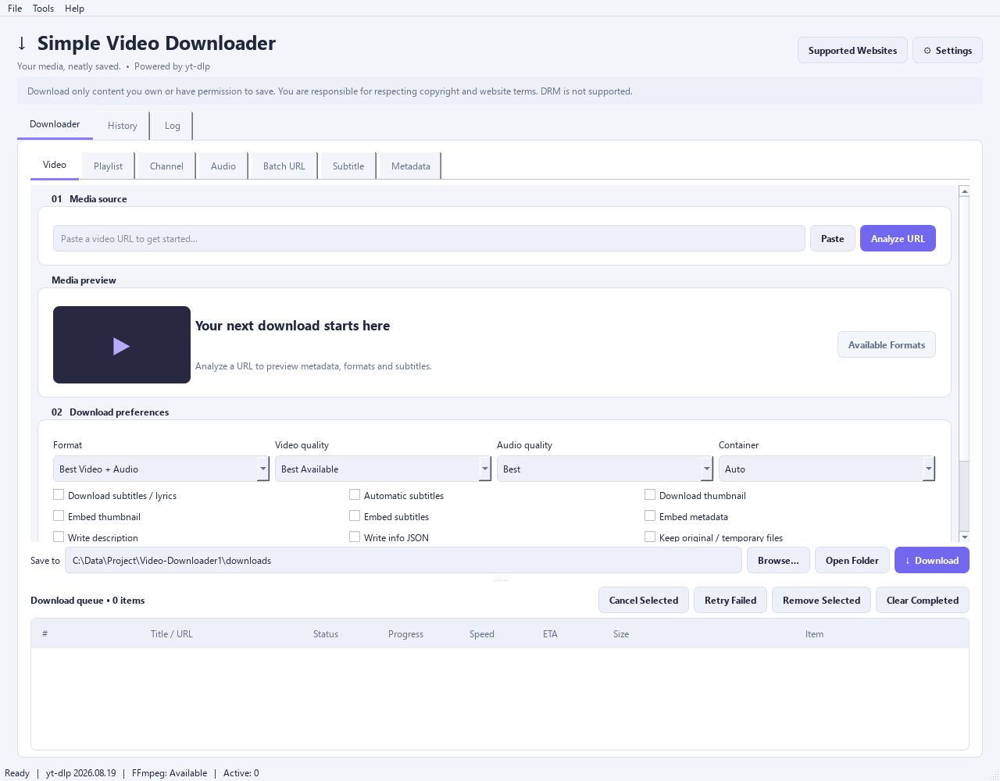
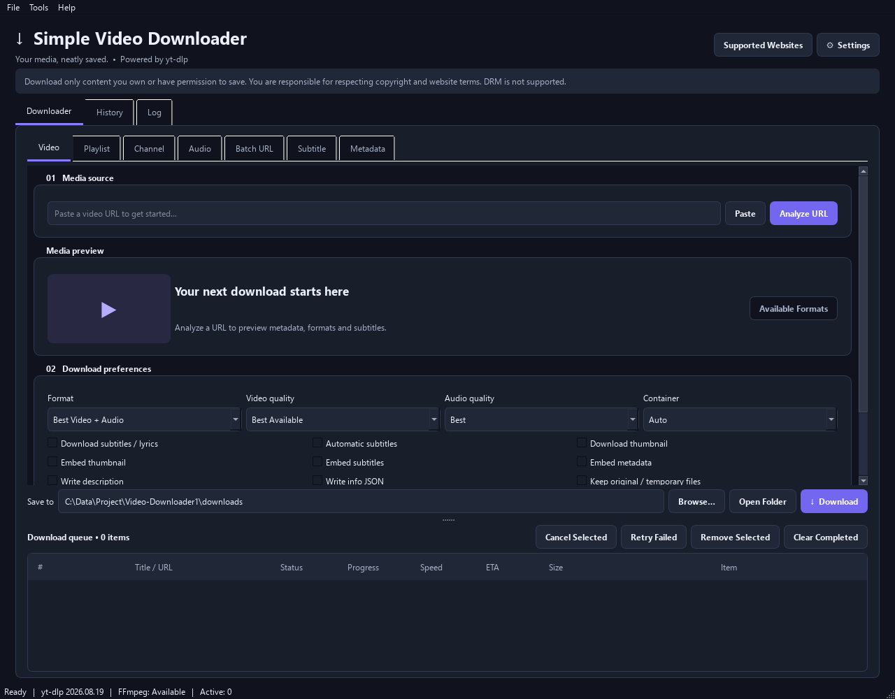

# ↓ Simple Video Downloader

<div align="center">

**Your media, neatly saved. Powered by yt-dlp.**

[](https://www.python.org/)
[](https://doc.qt.io/qtforpython/)
[](https://github.com/yt-dlp/yt-dlp)
[](#instalasi)
[](#lisensi)

</div>

---

**Simple Video Downloader** adalah aplikasi desktop berbasis GUI (Graphical User Interface) yang modern, kaya fitur, dan mudah digunakan untuk mengunduh video, audio, subtitle, playlist, saluran, dan siaran langsung dari **lebih dari 1.000 situs web** tanpa perlu mengetik satu baris pun perintah terminal.

Dibangun di atas fondasi [yt-dlp](https://github.com/yt-dlp/yt-dlp) yang sangat powerful, dibungkus dengan antarmuka grafis Qt yang responsif dan intuitif melalui [PySide6](https://doc.qt.io/qtforpython/).

---

## 📸 Tangkapan Layar

<div align="center">

| Mode Terang | Mode Gelap |
|:-----------:|:----------:|
|  |  |

</div>

---

## 📋 Daftar Isi

- [✨ Fitur Utama](#-fitur-utama)
- [🌐 Situs yang Didukung](#-situs-yang-didukung)
- [⚙️ Persyaratan Sistem](#persyaratan-sistem)
- [🚀 Instalasi](#-instalasi)
- [▶️ Cara Menjalankan](#cara-menjalankan)
- [📖 Panduan Penggunaan Lengkap](#-panduan-penggunaan-lengkap)
- [🎨 Format & Kualitas](#-format--kualitas)
- [⚙️ Pengaturan Lengkap](#pengaturan-lengkap)
- [📂 Struktur Proyek](#-struktur-proyek)
- [🏗️ Arsitektur Aplikasi](#arsitektur-aplikasi)
- [🔒 Keamanan & Privasi](#-keamanan--privasi)
- [🧪 Pengujian](#-pengujian)
- [🛠️ Troubleshooting](#troubleshooting)
- [🤝 Kontribusi](#-kontribusi)
- [📜 Lisensi](#-lisensi)

---

## ✨ Fitur Utama

### 🎬 Unduhan Multi-Mode

| Mode | Deskripsi |
|------|-----------|
| **Video** | Unduh video tunggal dengan kontrol format & kualitas penuh |
| **Audio** | Ekstrak audio dalam berbagai format (MP3, M4A, AAC, FLAC, WAV, Opus, Vorbis) |
| **Subtitle** | Unduh & konversi subtitle dalam berbagai bahasa dan format |
| **Playlist** | Unduh seluruh playlist sekaligus dengan kontrol item & urutan |
| **Channel** | Unduh video dari saluran/channel dengan filter tanggal & jumlah |
| **Live Stream** | Rekam siaran langsung dengan durasi yang dapat dikonfigurasi |
| **360° / VR** | Unduh video 360 derajat ekuirektangular secara eksklusif |
| **Metadata** | Unduh info JSON & thumbnail tanpa mengunduh video |

### 🚦 Manajemen Antrian Cerdas

- **Antrian multi-tasking** — unduh hingga **3 video secara bersamaan**
- **Jeda & lanjutkan** — kontrol penuh atas setiap item unduhan
- **Batal individual** atau semua unduhan sekaligus
- **Coba ulang otomatis** — dengan exponential backoff yang bisa dikonfigurasi
- **Coba ulang manual** — paksa retry segera tanpa menunggu timer
- **Status real-time** — kecepatan, ETA, progres, nama file, dan nama extractor tampil langsung
- **Riwayat unduhan** — tersimpan di SQLite, bisa dicari, difilter, dan diulang kembali
- **Arsip unduhan** — lewati URL yang sudah pernah diunduh secara otomatis

### 🎛️ Kontrol Format & Kualitas Mendalam

- Pilih format: Best Video+Audio, Best Video, Best Audio, MP4, WebM, Audio Only, atau format kustom yt-dlp
- Pilih kualitas resolusi: 144p hingga 2160p (4K) atau Best Available
- Pilih kualitas audio: 96 kbps hingga 320 kbps
- Format audio output: MP3, M4A, AAC, FLAC, WAV, Opus, Vorbis, atau Best Audio
- Container output: Auto, MP4, MKV, WebM, dan lainnya
- Format selector kustom yt-dlp penuh untuk pengguna mahir

### 📝 Template Nama File Fleksibel

- Template berbasis yt-dlp (`%(title)s`, `%(id)s`, `%(uploader)s`, `%(upload_date)s`, dll.)
- Preview nama file secara langsung sebelum mengunduh
- Validasi template otomatis — tidak bisa memasukkan path berbahaya

### 🌐 Dukungan Jaringan & Proxy

- **Proxy HTTP/HTTPS/SOCKS4/SOCKS4a/SOCKS5/SOCKS5h** lengkap
- Konfigurasi SOCKS5 dengan host, port, username, dan password
- Gunakan proxy sistem/environment atau nonaktifkan proxy sama sekali
- Batasi kecepatan unduhan (rate limit) — misalnya `2M` atau `500K`
- Pilih antarmuka jaringan (IPv4/IPv6 atau otomatis)
- Atur alamat sumber (source address) kustom

### 🔐 Autentikasi Multi-Metode

- **Username/password** langsung per unduhan
- **File netrc** (`.netrc`) — dukungan lokasi kustom
- **Cookie dari browser** (Chrome, Firefox, Edge, Safari, dll.)
- **File cookie Netscape** — untuk cookie yang diekspor secara manual
- Deteksi otomatis kebutuhan autentikasi berdasarkan analisis URL dan domain

### ⚡ Akselerator Unduhan aria2c

- Integrasi penuh dengan **aria2c** sebagai external downloader yt-dlp
- Konfigurasi koneksi per server (1–16)
- Konfigurasi jumlah split (1–16)
- Ukuran minimum split (1–1024 MiB)
- Deteksi dan validasi versi aria2c otomatis
- Nonaktifkan IPv6 untuk koneksi aria2c

### 📡 Siaran Langsung (Live Stream)

- Rekam siaran langsung dengan durasi maksimum 7 hari
- Opsi merekam dari awal stream (jika tersedia)
- Validasi status stream — cegah unduhan stream yang sudah berakhir
- Memerlukan FFmpeg untuk merekam live stream

### 🎭 Video 360° / VR

- Deteksi eksklusif format ekuirektangular berdasarkan metadata extractor
- Tidak pernah mengandalkan judul/tag untuk deteksi — hanya metadata resmi
- Selector format yang tepat untuk memastikan unduhan adalah konten VR sejati

### 🗄️ Riwayat & Database

- Database SQLite lokal — tidak ada data yang dikirim ke server mana pun
- Cari dan filter riwayat berdasarkan judul, URL, status, atau tipe media
- Hapus entri riwayat individual atau seluruh riwayat sekaligus
- Ulangi unduhan dari riwayat dengan satu klik
- Status task yang tertunda secara otomatis ditandai "Failed" saat aplikasi dimulai kembali

### 🔔 Notifikasi & UX

- **Notifikasi sistem tray** saat unduhan selesai atau gagal
- **Buka folder otomatis** setelah unduhan berhasil
- **Deteksi URL clipboard** — banner muncul otomatis saat URL terdeteksi
- **Impor URL massal** dari file teks
- **SponsorBlock** — hapus segmen sponsor secara otomatis
- **Mode tema**: Light, Dark, atau ikuti pengaturan sistem
- **Keyboard shortcuts** lengkap (`Ctrl+L`, `Ctrl+O`, `Ctrl+,`, `Ctrl+Q`, dll.)
- Status bar real-time: versi yt-dlp, status FFmpeg, jumlah worker aktif

### 🔒 Keamanan Bawaan

- Hanya argumen yt-dlp yang masuk daftar putih aman yang diizinkan di kolom "Extra Options"
- Kredensial tidak pernah disimpan ke file settings (session-only)
- Proxy dan credential tidak pernah masuk log
- URL diprivasi sebelum disimpan ke database
- Pengecekan versi Python dan dependensi saat startup
- Template nama file divalidasi — direktori traversal diblokir

---

## 🌐 Situs yang Didukung

Simple Video Downloader mendukung **lebih dari 1.000+ situs** melalui yt-dlp, termasuk (tidak terbatas pada):

<details>
<summary>📋 Klik untuk melihat daftar situs populer</summary>

| Kategori | Situs |
|----------|-------|
| **Video Streaming** | YouTube, Vimeo, Dailymotion, Twitch VOD, Facebook, Instagram, TikTok, Twitter/X |
| **Musik & Audio** | SoundCloud, Bandcamp, Spotify (metadata), Deezer, Tidal |
| **Dewasa** | OnlyFans, Fansly (memerlukan autentikasi) |
| **Berita & TV** | BBC iPlayer, CNN, NBC, ABC, CBS |
| **Pendidikan** | Coursera, Udemy, LinkedIn Learning, Khan Academy |
| **Podcast** | Podbean, Buzzsprout, SoundCloud Podcast |
| **Olahraga** | ESPN, NFL, NBA, MLB |
| **Anime** | Crunchyroll, Funimation, AnimeFreak |
| **Game** | Twitch, YouTube Gaming |
| **dan 990+ lainnya** | Cek **Tools > Supported Websites** di dalam aplikasi |

</details>

> **📌 Catatan:** Gunakan menu **Tools → Supported Websites** di dalam aplikasi untuk melihat daftar lengkap situs yang didukung beserta status kerjanya secara real-time.

---

## Persyaratan Sistem

### Wajib

| Komponen | Versi Minimum | Keterangan |
|----------|---------------|------------|
| **Python** | 3.11 | Wajib — diperiksa saat startup |
| **PySide6** | 6.8.x | GUI Qt6 — diinstal via pip |
| **yt-dlp** | 2026.8.19 | Engine unduhan — diinstal via pip |

### Opsional (Sangat Direkomendasikan)

| Komponen | Fungsi | Cara Mendapatkan |
|----------|--------|------------------|
| **FFmpeg** >= 4.4 | Merge video+audio, konversi format, embed subtitle/thumbnail/metadata, rekam live stream | [ffmpeg.org](https://ffmpeg.org/download.html) |
| **aria2c** | Akselerasi unduhan multi-koneksi | [aria2.github.io](https://aria2.github.io/) |

### Platform yang Didukung

- ✅ **Windows** 10/11 (64-bit) — dukungan penuh termasuk dialog popup error
- ✅ **macOS** 12+ (Monterey ke atas)
- ✅ **Linux** (Ubuntu 22.04+, Fedora 37+, Arch Linux, dll.)

---

## 🚀 Instalasi

### Metode 1: Dari Source Code (Direkomendasikan untuk Developer)

```bash
# 1. Clone atau unduh repository ini
git clone https://github.com/username/simple-video-downloader.git
cd simple-video-downloader
git clone https://github.com/Athallah1234/All-in-One-Video-Downloader.git
cd All-in-One-Video-Downloader

# 2. (Opsional, sangat direkomendasikan) Buat virtual environment
python -m venv .venv

# Aktifkan virtual environment:
# Windows:
.venv\Scripts\activate
# macOS / Linux:
source .venv/bin/activate

# 3. Install dependensi
pip install -r requirements.txt
```

### Metode 2: Dari File ZIP

1. Ekstrak `Simple-Video-Downloader.zip`
2. Buka terminal di folder hasil ekstrak
3. Jalankan: `pip install -r requirements.txt`

### Instalasi FFmpeg (Sangat Direkomendasikan)

**Windows (winget):**
```powershell
winget install --id Gyan.FFmpeg -e
```

**macOS (Homebrew):**
```bash
brew install ffmpeg
```

**Linux:**
```bash
sudo apt install ffmpeg     # Ubuntu/Debian
sudo dnf install ffmpeg     # Fedora
sudo pacman -S ffmpeg       # Arch Linux
```

### Instalasi aria2c (Opsional)

**Windows:**
```powershell
winget install --id aria2.aria2 -e
```

**macOS:**
```bash
brew install aria2
```

**Linux:**
```bash
sudo apt install aria2      # Ubuntu/Debian
sudo dnf install aria2      # Fedora
sudo pacman -S aria2        # Arch
```

---

## Cara Menjalankan

```bash
python main.py
```

Aplikasi akan otomatis:
1. Memeriksa versi Python (>= 3.11)
2. Memeriksa ketersediaan dependensi (`PySide6`, `yt-dlp`)
3. Memberikan pesan error yang jelas jika ada yang kurang — termasuk dialog popup di Windows
4. Menjalankan antarmuka grafis

**Tip Windows:** Buat file `start.bat` untuk kemudahan:
```batch
@echo off
python main.py
pause
```

---

## 📖 Panduan Penggunaan Lengkap

### Antarmuka Utama

Aplikasi terdiri dari **3 tab utama**:

| Tab | Fungsi |
|-----|--------|
| **Downloader** | Panel utama untuk memasukkan URL dan mengonfigurasi unduhan |
| **History** | Riwayat semua unduhan — bisa dicari, difilter, dan diulang |
| **Log** | Log aplikasi real-time untuk debugging |

### Mode Video

Mode default. Untuk mengunduh video tunggal dari URL apapun.

**Langkah:**
1. Tempel URL video di kolom **URL**
2. Klik **Analyze** — aplikasi akan mendeteksi jenis URL dan menyarankan mode yang tepat
3. Pilih **Format**, **Quality**, dan **Container** yang diinginkan
4. Atur **Output folder** tujuan
5. Klik **Download**

**Opsi tambahan:**
- Subtitle (manual dan otomatis), Thumbnail, Description, Info JSON
- Embed Subtitle/Thumbnail/Metadata ke dalam file (butuh FFmpeg)
- SponsorBlock — hapus segmen sponsor otomatis
- Keep Files — simpan file sebelum di-merge

### Mode Audio

1. Masukkan URL
2. Pilih mode **Audio**
3. Pilih **Audio Format** dan **Audio Quality**
4. Klik **Download**

> **Catatan:** FFmpeg wajib untuk konversi ke format spesifik. "Best Audio" tidak memerlukan FFmpeg.

### Mode Subtitle

1. Masukkan URL → pilih mode **Subtitle**
2. Pilih bahasa (`en`, `id`, `ja`, atau All Languages)
3. Pilih format: Best available, SRT, ASS, VTT
4. Aktifkan **Convert to SRT** jika perlu
5. Klik **Download**

### Mode Playlist

**Opsi khusus:**

| Opsi | Deskripsi |
|------|-----------|
| **Start** | Mulai dari item ke-N |
| **End** | Berhenti di item ke-N (0 = sampai akhir) |
| **Items** | Ekspresi yt-dlp (contoh: `1,3,5-7`) |
| **Reverse** | Urutan terbalik |
| **Random** | Urutan acak |

### Mode Channel

**Filter yang tersedia:**

| Pilihan | Deskripsi |
|---------|-----------|
| All Videos | Semua video di channel |
| Latest N Videos | N video terbaru |
| Oldest N Videos | N video terlama |
| Date Range | Video antara tanggal A dan B |
| Custom Playlist Items | Ekspresi kustom |

### Mode Live Stream

- Rekam siaran langsung (maksimum 7 hari)
- Atur durasi: Hours (0–168), Minutes (0–59), Seconds (0–59)
- Opsi **From Start** — rekam dari awal jika platform mendukung
- **Memerlukan FFmpeg** dan tidak mendukung proxy SOCKS

### Mode 360° / VR

- Hanya mengunduh format ekuirektangular berdasarkan metadata resmi
- Jika tidak ada format VR yang terdeteksi, error ditampilkan dengan jelas

### Mode Metadata

Mengunduh `.info.json` dan thumbnail tanpa file video.

---

## 🎨 Format & Kualitas

### Format Video

| Format | Deskripsi | Butuh FFmpeg? |
|--------|-----------|:---:|
| Best Video + Audio | Kualitas terbaik, gabungkan video+audio | ✅ |
| Best Video | Hanya stream video terbaik | ❌ |
| Best Audio | Hanya stream audio terbaik | ❌ |
| MP4 | Paksa output MP4 | ✅ |
| WebM | Paksa output WebM | ✅ |
| Audio Only | Stream audio saja | ❌ |
| Custom | Format selector yt-dlp kustom | Bergantung |

### Kualitas Resolusi

`Best Available` | `2160p (4K)` | `1440p (2K)` | `1080p (FHD)` | `720p (HD)` | `480p` | `360p` | `240p` | `144p`

### Format Audio Output

`MP3` | `M4A` | `AAC` | `FLAC` | `WAV` | `Opus` | `Vorbis` | `Best Audio`

### Kualitas Audio

`Best` | `320 kbps` | `256 kbps` | `192 kbps` | `128 kbps` | `96 kbps`

---

## Pengaturan Lengkap

Buka melalui **Settings** atau `Ctrl+,`.

### Pengaturan Umum

| Pengaturan | Default | Deskripsi |
|-----------|---------|-----------|
| Output Folder | `./downloads` | Folder tujuan unduhan |
| Theme | System | Light, Dark, atau ikuti sistem |
| Confirm Exit | On | Konfirmasi sebelum keluar |
| Auto Open Folder | Off | Buka folder otomatis setelah selesai |
| Monitor Clipboard | Off | Deteksi URL dari clipboard |
| Notifications | Off | Notifikasi system tray |
| Concurrency | 1 | Unduhan paralel (1–3) |
| Retries | 3 | Percobaan ulang pada kegagalan |
| Timeout | 30 s | Timeout koneksi |
| Download Archive | Off | Catat & lewati URL yang sudah diunduh |

### Pengaturan Jaringan & Proxy

| Pengaturan | Deskripsi |
|-----------|-----------|
| Proxy Type | System, No Proxy, Proxy URL, SOCKS5, SOCKS5h |
| Proxy URL | URL proxy (http/https/socks4/socks4a/socks5/socks5h) |
| SOCKS5 Host | Hostname atau IP |
| SOCKS5 Port | Port (1–65535, default: 1080) |
| Rate Limit | Batas kecepatan (contoh: `2M`, `500K`, `1.5M`) |
| IP Protocol | Auto, IPv4 only, IPv6 only |

### Pengaturan Autentikasi

| Pengaturan | Deskripsi |
|-----------|-----------|
| Site Login | Aktifkan autentikasi username/password |
| Username / Password | Tidak disimpan ke file (session-only) |
| Use Netrc | Gunakan file `.netrc` |
| Cookies | No Cookies / Cookie File / Cookies from Browser |

### Pengaturan FFmpeg

- Path folder FFmpeg. Kosong = cari di PATH otomatis
- Cek status: **Tools → FFmpeg Status**

### Pengaturan Aria2c

| Pengaturan | Default | Deskripsi |
|-----------|---------|-----------|
| Use aria2c | Off | Aktifkan aria2c sebagai external downloader |
| aria2c Path | (auto) | Path ke aria2c |
| Connections | 16 | Koneksi per server (1–16) |
| Splits | 16 | Jumlah split per file (1–16) |
| Min Split Size | 1 MiB | Ukuran minimum split (1–1024 MiB) |

> ⚠️ aria2c tidak mendukung proxy SOCKS. Gunakan HTTP/HTTPS proxy.

### Pengaturan Auto Retry

| Pengaturan | Default | Deskripsi |
|-----------|---------|-----------|
| Auto Retry | Off | Coba ulang otomatis saat gagal |
| Max Attempts | 3 | Jumlah maksimum retry (1–20) |
| Base Delay | 2 s | Delay awal (1–3600 detik) |
| Max Delay | 60 s | Delay maksimum (1–86400 detik) |

> Delay menggunakan **exponential backoff**: `min(max_delay, base_delay × 2^attempt)`

---

## 📂 Struktur Proyek

```
simple-video-downloader/
│
├── main.py                     # Entry point — pengecekan Python & dependensi
├── requirements.txt            # Dependensi pip
├── .gitignore
│
├── app/                        # Package utama aplikasi
│   ├── application.py          # Startup sequence & resource ownership
│   │
│   ├── core/                   # Logika bisnis & engine
│   │   ├── models.py           # Dataclass Task & enum Status
│   │   ├── format_builder.py   # Translator UI ke yt-dlp options
│   │   ├── queue_manager.py    # Bounded queue, koordinasi worker
│   │   ├── ffmpeg.py           # Deteksi & validasi FFmpeg/FFprobe
│   │   ├── aria2.py            # Deteksi & konfigurasi aria2c
│   │   ├── proxy.py            # Validasi & translasi opsi proxy
│   │   ├── live.py             # Validasi & konfigurasi live stream
│   │   ├── vr.py               # Selector & validasi video 360/VR
│   │   ├── auth_detection.py   # Deteksi kebutuhan autentikasi berbasis URL
│   │   ├── netrc_auth.py       # Pembaca file netrc
│   │   ├── url_resolver.py     # Resolver & validator URL
│   │   ├── existing_files.py   # Cek file yang sudah ada
│   │   ├── supported_sites.py  # Detektor & filter situs yang didukung
│   │   └── utils.py            # Utilitas umum
│   │
│   ├── ui/                     # Komponen antarmuka grafis (PySide6)
│   │   ├── main_window.py      # Jendela utama & koordinasi UI
│   │   ├── downloader.py       # Tab downloader (form URL, opsi, dll.)
│   │   ├── library.py          # Queue view, history tab, log tab
│   │   ├── dialogs.py          # Dialog settings, situs, about
│   │   ├── theme.py            # Manajemen tema Light/Dark/System
│   │   └── widgets.py          # Widget helper
│   │
│   ├── workers/
│   │   └── jobs.py             # DownloadWorker — thread yt-dlp
│   │
│   ├── services/
│   │   ├── settings.py         # Settings JSON — baca/tulis atomik
│   │   └── logging_service.py  # Inisialisasi sistem logging
│   │
│   └── database/
│       └── history.py          # SQLite repository untuk riwayat unduhan
│
├── assets/icons/app.svg        # Ikon aplikasi
├── docs/                       # Screenshot & dokumentasi
├── tests/                      # Test suite (16 file test)
├── data/                       # Data runtime (dibuat otomatis)
│   ├── settings.json           # Pengaturan pengguna
│   ├── history.db              # Database SQLite riwayat unduhan
│   └── download_archive.txt    # Arsip URL yang sudah diunduh
├── downloads/                  # Folder unduhan default
└── logs/                       # Folder log aplikasi
```

---

## Arsitektur Aplikasi

```
main.py
  └── application.py (QApplication, Settings, HistoryRepo, QueueManager, MainWindow)
        │
        ├── UI Layer (PySide6)
        │   ├── MainWindow      — shell & koordinasi
        │   ├── DownloaderTab   — form input URL & opsi
        │   ├── QueueView       — daftar unduhan aktif
        │   ├── HistoryTab      — riwayat SQLite
        │   └── LogTab          — log real-time
        │
        ├── Core Layer
        │   ├── QueueManager    — bounded queue, GUI-thread only
        │   │     └── DownloadWorker (QThread) — yt-dlp integration
        │   ├── format_builder  — translator UI → yt-dlp options
        │   ├── ffmpeg          — deteksi & validasi FFmpeg (LRU cache)
        │   ├── aria2           — deteksi & konfigurasi aria2c (LRU cache)
        │   ├── proxy           — validasi proxy semua mode
        │   ├── live            — konfigurasi & validasi live stream
        │   ├── vr              — selector & validasi 360/VR
        │   └── auth_detection  — offline auth likelihood estimator
        │
        └── Services / Data Layer
            ├── Settings        — JSON atomic write, session-key isolation
            ├── HistoryRepository — SQLite parameterized queries
            └── LoggingService  — file + in-app bus
```

### Prinsip Desain Utama

| Prinsip | Implementasi |
|---------|-------------|
| **Thread Safety** | Semua mutasi task dilakukan di GUI thread; worker hanya berkomunikasi via Qt Signals |
| **No Polling** | Pause menggunakan sistem token generasi — tidak ada busy-waiting |
| **Atomic Writes** | Settings ditulis ke `.tmp` lalu di-rename — tidak ada korupsi |
| **LRU Cache** | Deteksi FFmpeg/aria2c menggunakan cache berbasis mtime+size |
| **Allowlist Security** | Extra Options menggunakan allowlist ketat |
| **Privacy-First** | Proxy, credentials, cookies tidak pernah masuk log atau database |

---

## 🔒 Keamanan & Privasi

### Data yang Disimpan Secara Lokal

| Data | Lokasi | Keterangan |
|------|--------|------------|
| Pengaturan | `data/settings.json` | Tidak termasuk password/credentials |
| Riwayat | `data/history.db` | URL diprivasi sebelum disimpan |
| Arsip | `data/download_archive.txt` | Hanya URL, tanpa metadata sensitif |
| Log | `logs/` | Credentials diredaksi otomatis |

### Data yang TIDAK Disimpan

- ❌ Password, username site (session-only)
- ❌ Password SOCKS5 (session-only)
- ❌ Opsi proxy dan cookie
- ❌ Tidak ada data yang dikirim ke server eksternal

### Argumen "Extra Options" yang Diizinkan

```
--retries <n>               Jumlah percobaan ulang
--fragment-retries <n>      Percobaan ulang per fragment
--socket-timeout <detik>    Timeout soket
--sleep-interval <detik>    Jeda antara unduhan
--max-sleep-interval <det>  Jeda maksimum
--limit-rate <ukuran>       Batas kecepatan (misal: 2M, 500K)
--prefer-free-formats       Preferensikan format gratis
--no-mtime                  Jangan ubah timestamp file
```

Untuk `--username` / `--password` / `--netrc`, gunakan **Settings > Authentication**.

---

## 🧪 Pengujian

Proyek ini dilengkapi dengan **16 file test** yang mencakup semua komponen inti.

```bash
# Install pytest
pip install pytest

# Jalankan semua test
python -m pytest tests/ -v

# Dengan coverage report
pip install pytest-cov
python -m pytest tests/ --cov=app --cov-report=term-missing
```

### Cakupan Test

| File Test | Komponen yang Diuji |
|-----------|---------------------|
| `test_core.py` | format_builder, selector, build_options |
| `test_integration.py` | End-to-end download workflow |
| `test_ffmpeg_version.py` | Parsing versi FFmpeg berbagai format |
| `test_aria2.py` | Deteksi, validasi, konfigurasi aria2c |
| `test_proxy.py` | Semua mode proxy & validasi input |
| `test_auth_detection.py` | Deteksi autentikasi berbasis URL |
| `test_authentication.py` | Options username/password/netrc |
| `test_auto_retry.py` | Logika exponential backoff retry |
| `test_existing_files.py` | Pengecekan file yang sudah ada |
| `test_jobs.py` | DownloadWorker thread |
| `test_live.py` | Validasi & konfigurasi live stream |
| `test_netrc.py` | Parsing file netrc |
| `test_pause.py` | Mekanisme pause/resume |
| `test_url_detection.py` | Deteksi tipe URL & extractor |
| `test_url_resolver.py` | Resolver & validator URL |
| `test_vr.py` | Deteksi format 360/VR |

---

## Troubleshooting

### Aplikasi tidak mau jalan

**`Python 3.11 or newer is required.`**
```bash
python --version   # Pastikan >= 3.11
```

**`Missing dependencies: PySide6, yt-dlp`**
```bash
pip install -r requirements.txt
```

### Video diunduh tanpa audio

FFmpeg belum terpasang. Install FFmpeg lalu buka **Settings > FFmpeg** dan atur path-nya. Cek via **Tools > FFmpeg Status**.

### Unduhan gagal dengan error autentikasi

Gunakan salah satu: **Settings > Authentication > Site Login**, **Cookies from Browser**, atau **netrc file**.

### Kecepatan unduhan lambat

Aktifkan **aria2c** di **Settings > aria2c** dengan Connections: 16, Splits: 16.

### aria2c error dengan proxy SOCKS

aria2c tidak mendukung proxy SOCKS. Gunakan HTTP/HTTPS proxy atau nonaktifkan aria2c.

### Live stream gagal direkam

Pastikan FFmpeg terpasang, URL sedang live, dan tidak menggunakan proxy SOCKS.

### Error template nama file

Template harus berupa nama file saja, bukan path. Contoh benar:
```
%(title)s [%(id)s].%(ext)s
%(uploader)s - %(title)s.%(ext)s
```

### Reset pengaturan ke default

Hapus file `data/settings.json` — akan dibuat ulang dengan default saat dijalankan kembali.

---

## 🤝 Kontribusi

### Melaporkan Bug

Buat issue baru dengan menyertakan:
- Versi Python, yt-dlp, OS
- Log error dari tab **Log** di aplikasi
- Langkah untuk mereproduksi masalah

### Pull Request

```bash
git checkout -b feature/nama-fitur
# Buat perubahan
python -m pytest tests/ -v    # Pastikan test lulus
git commit -m "feat: deskripsi fitur"
git push origin feature/nama-fitur
```

**Standar kode:**
- Tulis docstring untuk fungsi/kelas baru
- Tambahkan test untuk fitur/bugfix baru
- Jaga single responsibility per modul

---

## 📜 Lisensi

Proyek ini dilisensikan di bawah **MIT License** — lihat file [LICENSE](LICENSE) untuk detail lengkap.

---

## ⚠️ Disclaimer

> Aplikasi ini hanya boleh digunakan untuk mengunduh konten yang **Anda miliki** atau yang **Anda memiliki izin untuk menyimpannya**. Pengguna sepenuhnya bertanggung jawab atas kepatuhan terhadap hak cipta, syarat layanan platform, dan peraturan hukum yang berlaku.
>
> **DRM (Digital Rights Management) tidak didukung.**

---

## 🙏 Kredit

- **[yt-dlp](https://github.com/yt-dlp/yt-dlp)** — Engine unduhan yang luar biasa powerful
- **[PySide6 / Qt](https://doc.qt.io/qtforpython/)** — Framework GUI yang kokoh dan lintas platform
- **[FFmpeg](https://ffmpeg.org/)** — Swiss-army knife untuk multimedia
- **[aria2](https://aria2.github.io/)** — Akselerator unduhan multi-protokol

---

<div align="center">

**Dibuat dengan ❤️ untuk komunitas open source**

⭐ Jika proyek ini bermanfaat, berikan bintang di GitHub! ⭐

</div>
